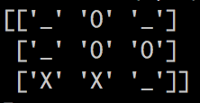

# Tic Tac Toe: Q-Learner

## Tl;dr
Run [main.py](https://github.com/lucaschapin/tictactoe-q-learner/blob/master/main.py) after uncommenting specific lines to train an AI to play tictactoe

## Overview
This repo trains an AI to learn the game of tic tac toe, starting *tabula rasa* with no training data. The AI learns through self play without any human input other than the rules of the game and can build an optimal Q strategy after only a few hours of training on a MacBook Pro.

## How to run it yourself
Clone this repo, uncomment a function of your choice from main.py, then run "python main.py" in the terminal to experiment with the Q learner. q_saved.p contains the AI's saved optimal Q strategy after several hours of training, but you can also train it yourself! Uncomment specific lines in main.py to do this. 
1. First run *train_from_scratch()* to clear out the existing saved strategy and start fresh. The next order of training is up to you, but make sure to run *test_learner_against_rando()* periodically so you can see how it's doing against a player making random moves. Over time, you should see the loss rate drop to 0. 
2. Run *train_learner_against_rando(n_games=100000)* and re-run this many times with testing in between to see how the AI improves over hundreds of thousands or even millions of games. This will give the AI a good base but isn't the most efficient training method. 
3. Next run *train_learner_against_self()*, which will speed up the training process as the AI plays evolving versions of itself. You may need to run this for a few hours, which you can do by either running it many times or increasing *n_sessions* well above the default 5 sessions. Even with this training method, you might start to notice a plateau in the AI's performance where it still loses ~1% of games and can't seem to find a completely perfect strategy. 
4. Run *adversarial_training()* a handful of times to refine its strategy even more and get it from near-perfect to perfect. 

With your AI sufficiently trained, you should be able to run *test_learner_against_rando()* see a perfect score where it wins or ties all 1000 out of 1000 games it plays against a random player. Still skeptical? Run *test_learner_against_human()* and try to beat it yourself!

## Understanding the Code
[environment.py](https://github.com/lucaschapin/tictactoe-q-learner/blob/master/environment.py) contains everything needed to run a single tic tac toe game. It holds two classes, Player() and Game(), which are used to determine how a player makes moves and specify the framework for running a tic tac toe game, respectively. [simulator.py](https://github.com/lucaschapin/tictactoe-q-learner/blob/master/simulator.py) contains functions to train and test the AI over a number of games. I've included extensive commentary in both files to detail exactly how they work. [main.py](https://github.com/lucaschapin/tictactoe-q-learner/blob/master/main.py) is the file you should actually run to do the training and testing.

The key piece to understand is how Q-learning works and where in the code this training process happens. Q is often thought of as a table, but in Python terms it's actually a dictionary, with board states as the keys and another dictionary as values wich contains possible actions and a Q value for those actions. For example, here's one randomly chosen key,value pair from our trained Q file:

`('_', 'O', '_', '_', 'O', 'O', 'X', 'X', '_'): {(1, 0): 0.05, (0, 0): -0.32, (0, 2): -0.5, (2, 2): 0.32}`

The tuple is a flattened version of our 2D tic tac toe game. Here's how it looks on a board:

The tuples, e.g. `(1,0)` represent different possible actions that X could take in (row,col) format starting with 0 since that's how counting in python works and I was too lazy to make this more user friendly :). (1,0) is the middle left, (0,0) is the top left, (0,2) is the top right, and (2,2) is the bottom right. The corresponding values are Q values for each action given the current board state, where positive values mean that taking the action will generally lead to a win, and negative values mean taking that action will generally lead to a loss. Thus the Q-learner here recommends that we play in the bottom right, which makes since because this will win the game immediately. The next highest value is for the middle left, which would block O from winning and set us up for a potential win on the next move if O doesn't block us. The other values are negative, which shows that in the Q learner's experience, these moves most often result in a loss. Over time, given enough simulations where we encounter this exact board positin, we'd expect the (2,2) action for this state to keep leading to wins and we'd see the Q-value converge toward the maximum value of 1.

To update Q, we use the following formula:

`Q(s,a) = (1- learning_rate) * old_Q(s,a) + learning_rate * reward`

The "reward" is the eventual game outcome, which is either 1 for a win, 0 for a tie, or -1 for a loss. We move Q for this particular state and action toward the reward for the outcome of the game, and the magnitude of that Q-value adjustment is dependent on our choice of learning rate.

Another piece to understand is *epsilon*, the exploration factor. The *basic_q* strategy implemented in our Player() class is that given a board state, the AI will choose the action with the highest Q value, *unless* a randomly chosen number from 0 to 1 is less than *epsilon*, in which case we make a random move out of the available possible actions. In other words, *epsilon* represents a percentage chance of ignoring our existing Q learning dictionary and instead making a random move. This is crucial to the trial and error process of teaching the AI what works and what doesn't. Over time, we decrease this *epsilon* value toward 0 and we should see its win rate increase as it makes deliberate moves. We set *epsilon* to 0 when testing so we can see how well our AI has learned when it relies solely on its Q file, and we also set *epsilon* to 0 for the opponent (player "O") in self play. This allows the learner AI ("X") to continue experimenting while playing a strong player which relies only on its Q strategy.

## Requirements
See [requirements.txt](https://github.com/lucaschapin/tictactoe-q-learner/blob/master/requirements.txt) for more details. In short, run this using Python 2.7 and make sure you have Pandas and a few supporting libraries installed. If you use the Anaconda distribution of Python, this should cover everything you need.

## Future Improvements
* Running [main.py](https://github.com/lucaschapin/tictactoe-q-learner/blob/master/main.py) is a little janky as it requires the user to clone this repo and modify the file before running. This could easily be replaced by a method that uses command line arguments or prompts to run the code without modifying any files.
* It's not obvious when to run which training functions. To make this more clear, we could guide the user through a specific sequence of training and testing rather than leaving it ad hoc. For educational purposes, it would be neat to accompany this with visuals and commentary along the way.
* Speaking of visuals, functions could definitely use some work to better demonstrate how the AI learns over time
* Typically in Q learning, the reward for a (state,action) pair is the expected value of the next state, choosing the optimal action. Although we don't know the next state immediately since it's the opponent's move, we could take a page out of AlphaGo's book and use Monte Carlo Tree Search to project forward what the next moves will be. Instead, I used a very simple method to update the weights which is to wait until the end of the game and use that reward to update all (state,action) pairs. This proved sufficient for tic tac toe but would not scale well to more complicated games.
* I didn't apply a discount factor which would have helped the AI choose winning moves more quickly. This could speed up the training process.
* While it's overkill for tic tac toe, we could build a neural net to approximate the Q strategy which would scale better to bigger data sets where Q tables are insufficient. Moreover, given the surge in interest in deep learning, it would be an interesting to compare the Q table approach directly to training a neural net to help elucidate the differences in approaches.
* Instead of using tuples to enter moves, it would be more user friendly to input *bottom right*, *middle*, etc.

## Kudos
In researching Q-learning in the context of adversarial games, the following sources were especially helpful:
* [AlphaGo The Movie](https://www.rottentomatoes.com/m/alphago/) and [DeepMind's seminal research paper](https://www.nature.com/articles/nature24270.epdf) inspired this project in the first place. In particular, I was attracted to the idea of training an AI "tabula rasa" -- using only self play without any starting data or hard-coded strategies
* [Scott Rome's blackjack learner](http://srome.github.io/Train-A-Neural_Net-To-Play-Black-Jack-With-Q-Learning/) provided a clear guide to Q-learning in the context of an adversarial game
* [Arthur Juliani's article](https://medium.com/emergent-future/simple-reinforcement-learning-with-tensorflow-part-0-q-learning-with-tables-and-neural-networks-d195264329d0) helped me understand why a simple Q table was the right approach here and when a neural network starts to become more practical
